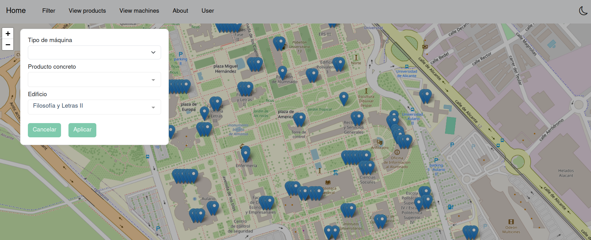

<div align="center">
  
</div>


#### Encuentra la mejor máquina expendedora cuando más la necesitas.
<hr>


[](https://github.com/nhn/tui.editor/blob/master/LICENSE) 
[](https://github.com/nhn/tui.editor/issues?q=is%3Aissue+is%3Aopen+label%3A%22help+wanted%22) 


# 


### Proyecto creado durante el curso 2023-2024 en la asignatura de **TAES** (*TÉCNICAS AVANZADAS DE ESPECIFICACIÓN SOFTWARE*) de la [Escola Politècnica Superior](https://eps.ua.es/) en la [Universitat d'Alacant](https://www.ua.es/).


## 🚩 Tabla de contenidos

- [¿Por qué usar maquinua?](#-why-maquinua)
- [Levantar el proyecto en local](#-create-your-maquinua)
- [Contributing](#-contributing)
- [Tecnologías utilizadas](#-tecnologies)
- [Maquinua Team](#-maquinua-team)
- [License](#-license)

## 🤖 ¿Por qué *maquinua*?

**maquinua** es una aplicación web que te permite encontrar la máquina expendedora más cercana a tu ubicación en la [Universitat d'Alacant](https://www.ua.es/). Puedes filtrar por tu facultad, nombre del producto y muchos más. Encontrás la ubicación de la máquina en un mapa.

### 🔎 Tipos de filtros.

- **Facultad**: Filtra por la facultad en la que te encuentras.
- **Tipo de máquina**: Filtra por el tipo de máquina que buscas.
- **Nombre del producto**: Filtra por el nombre del producto que buscas.
- **Precio del producto**: Filtra por el precio del producto que buscas.
- **Empresa**: Filtra por la empresa que gestiona la máquina.

## 🚀 Levantar el proyecto en local

### Descarga el proyecto en tu máquina local siguiendo los siguientes pasos:

```sh
git clone https://github.com/jcerveto/maquinua.git
cd maquinua
```


### Levanta la página web en tu máquina local siguiendo los siguientes pasos:

Ves a la carpeta `frontend/maquinua`.
```sh
cd frontend/maquinua
```

Descarga las dependencias del proyecto.
```
npm install
```

Compiles and hot-reloads for development
```
npm run serve
```

Lints and fixes files
```
npm run lint
```

Customize configuration
See [Configuration Reference](https://cli.vuejs.org/config/).

<hr>

### Levanta la base de datos en tu máquina local siguiendo los siguientes pasos:

Ves a la carpeta `backend`.
```sh
cd backend
```

Ejecuta el `docker-compose` para levantar la base de datos y el servidor **HTTP**.
```sh
docker-compose up -d
```

### Con más detalles:
Levantar todo: BBDD (MongoDB) + Backend HTTP (NodeJs Express)
```sh
docker-compose up
```

Se pueden levantar por separado los contenedores. Pero habría que configurar también la *network*. 

Levantar base de datos
```sh
docker-compose run <container-name>
```

Una vez el contenedor ya esté corriendo, podemos entrar dentro con el siguiente comando:
```sh
docker exec -it backend-maquinua-container sh
```
Desde aquí podemos ejecutar test como `node src/services/db.test.js` de manera interactiva.

**¡OJO en Windows!**
Si estás en Windows y no te funciona, aasegúrate de estar ejecutando Docker desktop, no solamente los comandos por terminal. 


## 🛠 Tecnologías utilizadas
En este proyecto se han utilizado las siguientes tecnologías:

### Node.js


### Vue.js


### Express.js


### Docker


### MongoDB


### OpenStreetMap


## 📚 Maquinua Team

### Profesorado
* Javier Fernández Martínez
* Pla Sempere, Leopoldo

### Alumnado
* Joan Cerveto Serrano
* Adrián Romero Romero
* etc

## 💬 Contributing

### Colabora con nosotros para mejorar **maquinua**.
Ves a [Contributing.md](CONTRIBUTING.md) para más información.


## 📜 License

This software is licensed under the [APACHE VERSION 2.0](LICENSE.md).
